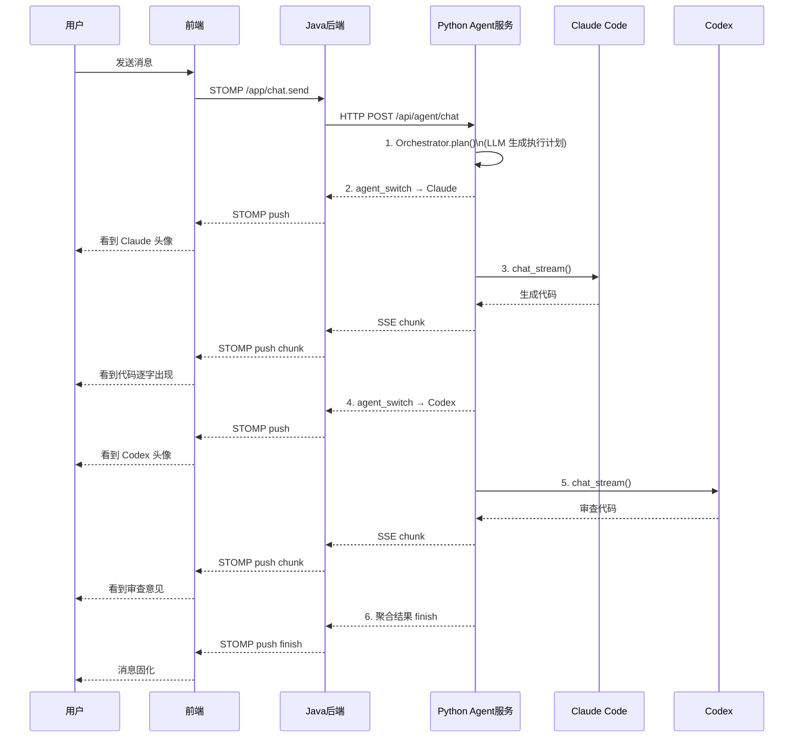

# AgentHub 技术框架文档 — Orchestrator 调度器设计方案
>版本: v1.0\
>创建日期: 2026-06-03\
>用途: Orchestrator 模块的架构设计、实现方案选择与完整功能流程定义\
>关联问题: P3 agent_switch 事件契约、Orchestrator 实现方式
---
## 1. 核心问题回答：Orchestrator 应该作为什么来实现？
答案：不是工具类，而是一个独立的调度服务模块。

### 1.1 为什么不设计成工具类？
| 考量维度 | 工具类（Utility Class） | 独立服务模块（Service Module） |
| --- | --- | --- |
| 状态管理 | 无状态，每次调用独立 | 需要维护任务执行状态（拆解的任务列表、每个子任务的完成状态） |
| 生命周期 | 调用即结束 | 一次用户请求 → 多次 Agent 调用 → 聚合结果，跨越多个异步操作 |
| 错误恢复 | 调用失败直接抛异常 | 需要部分失败时的降级策略（一个 Agent 失败，其他继续） |
| 并行/串行控制 | 无法控制 | 需要根据任务依赖关系决定并行还是串行执行 |
| 可测试性 | 难以模拟调度过程 | 可以 mock 各个 Agent，测试调度逻辑本身 |

Orchestrator 需要在整个任务执行过程中保持状态、处理多个 Agent 的异步回调、并最终聚合结果。这些特性决定了它是一个有状态的服务，而非无状态的工具类。

---

## 2. 实现方案对比
### 方案 A：硬编码编排（当前 MVP 推荐）
实现方式：在 Python Agent 服务的 main.py 或一个独立的 orchestrator.py 模块中，编写固定的调度逻辑。

#### 架构示意：
```text
用户消息 → Java 后端 → FastAPI /api/agent/chat
                            ↓
                     orchestrator.execute()
                            ↓
              ┌─────────────┼─────────────┐
              ↓             ↓             ↓
         Claude Code    Codex        自定义 Agent
         (写前端代码)   (写后端代码)   (写测试)
              ↓             ↓             ↓
              └─────────────┼─────────────┘
                            ↓
                     聚合结果 → 返回给前端
```
#### 代码骨架：
```python
# agent-service/orchestrator.py

import asyncio
from typing import AsyncGenerator
from adapters.adapter_factory import AdapterFactory

class SimpleOrchestrator:
    """
    硬编码编排器：按固定流程依次调用 Agent
    适用场景：任务类型明确，流程固定的场景
    """

    def __init__(self, adapter_factory: AdapterFactory):
        self.factory = adapter_factory

    async def execute(self, user_message: str) -> AsyncGenerator[dict, None]:
        """
        固定流程：
        1. Claude Code 生成前端代码
        2. Codex 审查代码
        3. 返回最终结果
        """
        # 阶段1：用 Claude Code 生成代码
        yield {"type": "agent_switch", "agentId": "agent_claude_001", "agentName": "Claude Code"}
        claude = self.factory.get_adapter("claude_code")
        async for token in claude.chat_stream(
            system_prompt="你是一个前端开发专家，用 React 生成代码。",
            context=user_message
        ):
            yield {"type": "chunk", "content": token, "agentId": "agent_claude_001"}

        # 阶段2：用 Codex 审查代码
        yield {"type": "agent_switch", "agentId": "agent_codex_001", "agentName": "Codex"}
        codex = self.factory.get_adapter("codex")
        async for token in codex.chat_stream(
            system_prompt="你是一个代码审查专家，审查以下代码并给出改进建议。",
            context=f"审查以下代码：\n{claude_result}"
        ):
            yield {"type": "chunk", "content": token, "agentId": "agent_codex_001"}

        yield {"type": "finish", "messageId": generate_id()}
```
#### 优点：

实现简单，MVP 阶段半天即可完成

流程清晰，调试方便

不引入任何外部依赖（仅用 Python 标准库）

#### 缺点：

流程写死，不支持动态任务拆解

新增 Agent 或调整流程需要修改代码

没有失败降级能力

#### 适用场景：
MVP 演示、固定流程的 Demo

---

### 方案 B：LLM 驱动的动态编排（P1 推荐）
#### 实现方式：
Orchestrator 本身也是一个 Agent（一个特殊的 LLM 调用），它的职责是理解用户意图、制定执行计划、输出调度指令。

#### 架构示意：
```text
用户消息 → Java 后端 → FastAPI /api/agent/chat
                            ↓
                   ┌─────────────────────┐
                   │  Orchestrator Agent  │
                   │  (LLM 调用)          │
                   │                      │
                   │  输入：用户消息       │
                   │  输出：JSON 执行计划  │
                   └─────────┬───────────┘
                             ↓
              {
                "steps": [
                  {"agent": "claude_code", "task": "写前端组件"},
                  {"agent": "codex", "task": "写后端接口"},
                  {"agent": "claude_code", "task": "整合前后端"}
                ]
              }
                             ↓
              ┌──────────────┼──────────────┐
              ↓              ↓              ↓
         Claude Code       Codex       Claude Code
              ↓              ↓              ↓
              └──────────────┼──────────────┘
                             ↓
                     聚合结果 → 返回给前端
```
#### 代码骨架：
```python
# agent-service/orchestrator.py

import json
import asyncio
from typing import AsyncGenerator, List
from pydantic import BaseModel

class TaskStep(BaseModel):
    """执行计划中的单个步骤"""
    agent: str          # Agent 类型
    task: str           # 任务描述
    dependsOn: List[int] = []  # 依赖的步骤索引（用于并行优化）

class ExecutionPlan(BaseModel):
    """Orchestrator 输出的执行计划"""
    steps: List[TaskStep]

class LLMOrchestrator:
    """
    LLM 驱动的动态编排器
    核心思想：用 LLM 做规划，后端执行
    """

    def __init__(self, adapter_factory, planner_llm):
        self.factory = adapter_factory
        self.planner = planner_llm

    async def _generate_plan(self, user_message: str) -> ExecutionPlan:
        """用 LLM 生成执行计划"""
        prompt = f"""
        你是一个任务规划专家。根据用户的需求，将任务拆解为多个步骤，
        每个步骤指定一个 Agent 来执行。

        可用的 Agent：
        - claude_code: 擅长前端开发和代码生成
        - codex: 擅长后端开发和代码审查

        用户需求：{user_message}

        请以 JSON 格式输出执行计划：
        {{
          "steps": [
            {{"agent": "claude_code", "task": "具体任务描述", "dependsOn": []}},
            {{"agent": "codex", "task": "具体任务描述", "dependsOn": [0]}}
          ]
        }}
        """
        response = await self.planner(prompt)
        plan = ExecutionPlan.parse_raw(response)
        return plan

    async def execute(self, user_message: str) -> AsyncGenerator[dict, None]:
        """执行动态规划的任务"""
        # 1. 生成计划
        plan = await self._generate_plan(user_message)

        # 2. 存储每个步骤的结果
        results = {}

        # 3. 按顺序执行（P2 可改为并行执行无依赖的步骤）
        for i, step in enumerate(plan.steps):
            # 推送 agent_switch 事件
            agent_id = f"agent_{step.agent}_001"
            agent_name = step.agent.replace("_", " ").title()
            yield {"type": "agent_switch", "agentId": agent_id, "agentName": agent_name}

            # 构建上下文（包含前面步骤的结果）
            context = f"任务：{step.task}\n"
            for dep_idx in step.dependsOn:
                context += f"\n前序步骤结果：\n{results[dep_idx]}\n"

            # 执行
            adapter = self.factory.get_adapter(step.agent)
            full_response = ""
            async for token in adapter.chat_stream(
                system_prompt=self._get_system_prompt(step.agent),
                context=context
            ):
                full_response += token
                yield {"type": "chunk", "content": token, "agentId": agent_id}

            results[i] = full_response

        yield {"type": "finish", "messageId": generate_id()}

    def _get_system_prompt(self, agent_type: str) -> str:
        prompts = {
            "claude_code": "你是一个前端开发专家...",
            "codex": "你是一个后端开发专家..."
        }
        return prompts.get(agent_type, "")
```
#### 优点：

任务动态拆解，适应任意用户需求

新增 Agent 只需在 System Prompt 中声明

天然支持 agent_switch 事件

答辩时展示 LLM 做规划的完整链路，技术深度高

#### 缺点：

多了一次 LLM 调用（规划阶段），增加延迟和成本

LLM 输出的 JSON 可能不稳定，需要做格式校验和容错

实现复杂度高于方案 A

---

### 方案 C：LangGraph 状态图编排（P2 演进方向）
#### 实现方式：
使用 LangGraph 构建有状态的调度图，支持条件分支、并行执行、人工确认节点。

#### 架构示意：
```python
# agent-service/orchestrator_langgraph.py

from langgraph.graph import StateGraph, END
from typing import TypedDict, List

class OrchestratorState(TypedDict):
    user_message: str
    plan: List[dict]
    current_step: int
    results: dict
    final_output: str

def create_orchestrator_graph():
    workflow = StateGraph(OrchestratorState)

    # 节点定义
    workflow.add_node("plan", plan_node)         # 规划节点
    workflow.add_node("claude", claude_node)     # Claude 执行节点
    workflow.add_node("codex", codex_node)       # Codex 执行节点
    workflow.add_node("aggregate", aggregate_node) # 聚合节点

    # 边定义（控制流）
    workflow.set_entry_point("plan")
    workflow.add_conditional_edges(
        "plan",
        route_to_agent,        # 根据计划路由到不同 Agent
        {"claude": "claude", "codex": "codex", "aggregate": "aggregate"}
    )
    workflow.add_edge("claude", "aggregate")
    workflow.add_edge("codex", "aggregate")
    workflow.add_edge("aggregate", END)

    return workflow.compile()
```
#### 优点：

可视化流程图，调度逻辑一目了然

状态自动持久化，支持暂停/恢复

天然支持并行分支和条件路由

LangGraph 社区活跃，AI 编程工具生成质量高

#### 缺点：

引入新依赖，学习曲线较陡

MVP 阶段过度设计

---

## 3. 完整功能流程
### 3.1 时序图

### 3.2 分步详解
#### 阶段 1：用户发送消息
##### 触发：
用户在聊天窗口输入消息并点击发送

##### 前端处理：
```javascript
// 1. 本地添加用户气泡
chatStore.messages.push({
  senderType: 'user',
  content: '帮我做一个个人博客主页',
  messageType: 'text'
});

// 2. 通过 WebSocket 发送（不指定 Agent，由 Orchestrator 决定）
wsClient.sendMessage({
  conversationId: 'conv_abc123',
  content: '帮我做一个个人博客主页'
});
```
#### 阶段 2：Java 后端接收并转发
##### Java 后端处理：
```java
// WebSocketController.java
@MessageMapping("/chat.send")
public void handleUserMessage(@Payload SendMessageRequest request) {
    // 1. 持久化用户消息
    messageService.saveUserMessage(request.getConversationId(), request.getContent());

    // 2. 构建上下文
    List<Map<String, Object>> context = messageService.buildContext(request.getConversationId());

    // 3. 调用 Python Agent 服务（不传 agentType，让 Orchestrator 自动决策）
    Flux<String> stream = agentGatewayService.sendToAgent(
        null,           // agentType = null，表示让 Orchestrator 自动选择
        null,           // systemPrompt = null，使用 Agent 默认值
        context
    );

    // 4. 流式转发给前端
    stream.subscribe(chunk -> messagingTemplate.convertAndSend(
        "/topic/conversation." + request.getConversationId(),
        parseChunk(chunk)
    ));
}
```
#### 阶段 3：Orchestrator 制定执行计划
##### Python Agent 服务处理：
```python
# main.py
@app.post("/api/agent/chat")
async def agent_chat(request: ChatRequest):
    # agentType 为空时，启动 Orchestrator
    if not request.agentType:
        orchestrator = LLMOrchestrator(adapter_factory, planner_llm)
        return StreamingResponse(
            orchestrator.execute(request.messages[-1].content),
            media_type="text/event-stream"
        )

    # agentType 指定时，直接调用对应 Agent（用户手动选择）
    adapter = adapter_factory.get_adapter(request.agentType)
    return StreamingResponse(
        adapter.chat_stream(request.systemPrompt, format_context(request.messages)),
        media_type="text/event-stream"
    )
```
##### Orchestrator 规划逻辑：
```python
# orchestrator.py - LLMOrchestrator._generate_plan()
async def _generate_plan(self, user_message: str) -> ExecutionPlan:
    prompt = f"""
    你是一个任务规划专家。根据用户的需求，将任务拆解为多个步骤。

    可用的 Agent：
    - claude_code: 擅长前端开发（React、Vue）、代码生成
    - codex: 擅长后端开发（API、数据库）、代码审查

    用户需求：{user_message}

    输出 JSON 格式的执行计划。每个步骤包含：
    - agent: 执行该步骤的 Agent 类型
    - task: 具体任务描述
    - dependsOn: 依赖的前序步骤索引列表
    """
    response = await self.planner(prompt)
    # 示例输出：
    # {
    #   "steps": [
    #     {"agent": "claude_code", "task": "设计前端页面结构和样式", "dependsOn": []},
    #     {"agent": "codex", "task": "编写后端 API 接口", "dependsOn": []},
    #     {"agent": "claude_code", "task": "整合前后端代码", "dependsOn": [0, 1]}
    #   ]
    # }
    return ExecutionPlan.parse_raw(response)
```
##### 阶段 4：依次执行各步骤（串行模式）
```python
# orchestrator.py - LLMOrchestrator.execute()
async def execute(self, user_message: str) -> AsyncGenerator[dict, None]:
    plan = await self._generate_plan(user_message)
    results = {}

    for i, step in enumerate(plan.steps):
        # === 推送 agent_switch 事件 ===
        agent_id = f"agent_{step.agent}_001"
        agent_name = step.agent.replace("_", " ").title()
        yield {
            "type": "agent_switch",
            "agentId": agent_id,
            "agentName": agent_name
        }

        # === 构建上下文（包含依赖步骤的结果）===
        context = f"当前任务：{step.task}\n"
        for dep_idx in step.dependsOn:
            context += f"\n前置步骤结果：\n{results[dep_idx]}\n"

        # === 调用 Agent 并流式返回 ===
        adapter = self.factory.get_adapter(step.agent)
        full_response = ""
        async for token in adapter.chat_stream(
            system_prompt=self._get_system_prompt(step.agent),
            context=context
        ):
            full_response += token
            yield {
                "type": "chunk",
                "content": token,
                "agentId": agent_id,
                "agentName": agent_name
            }

        results[i] = full_response

    yield {"type": "finish", "messageId": generate_id()}
```
##### 阶段 5：前端接收并渲染
```javascript
// chatStore.js
function handleIncomingMessage(chunk) {
  // 解析从后端 WebSocket 推送的数据
  const data = JSON.parse(chunk);

  if (data.type === 'agent_switch') {
    // Agent 切换事件：更新当前发言人
    streamingMessage.value.agentId = data.agentId;
    streamingMessage.value.agentName = data.agentName;
    // 可以触发过渡动画
  }
  else if (data.type === 'chunk') {
    // 内容片段：追加文本
    streamingMessage.value.content += data.content;
    streamingMessage.value.isStreaming = true;
  }
  else if (data.type === 'finish') {
    // 消息结束：固化到消息列表
    messages.value.push({
      senderType: 'agent',
      agentId: streamingMessage.value.agentId,
      agentName: streamingMessage.value.agentName,
      content: streamingMessage.value.content,
      messageId: data.messageId
    });
    streamingMessage.value = { agentId: '', agentName: '', content: '', isStreaming: false };
  }
}
```

---

## 4. 推荐实现路线
| 阶段 | 方案 | 目标 |
| --- | --- | --- |
| MVP（当前） | 方案 A：硬编码编排 | 跑通完整链路，Demo 演示固定流程 |
| P1（核心功能） | 方案 B：LLM 动态编排 | 支持任意任务自动拆解，答辩展示核心技术 |
| P2（进阶） | 方案 C：LangGraph 状态图 | 支持并行执行、人工确认、暂停恢复 |

### 渐进式迁移路径
```text
方案 A（硬编码）
    ↓
    将硬编码的 step 列表替换为 LLM 生成的 ExecutionPlan
    ↓
方案 B（LLM 动态编排）
    ↓
    将 execute() 中的 for 循环替换为 LangGraph 的 StateGraph
    ↓
方案 C（LangGraph 状态图）
```
每一阶段的接口契约（execute() 返回 AsyncGenerator[dict]）保持不变，上层 main.py 的调用方式完全一致，实现渐进式替换。

---

## 5. 与 P3 问题的关联
本文档中定义的 `agent_switch` 事件格式：
```json
{
  "type": "agent_switch",
  "agentId": "agent_claude_001",
  "agentName": "Claude Code"
}
```
在每个步骤开始执行前由 Orchestrator 推送。结合 P3 修复方案（每个 `chunk` 也携带 `agentId`），最终的数据流具有双重保障：

| 事件 | 触发时机 | 作用 |
| --- | --- | --- |
| agent_switch | Agent 切换时 | 前端可播放过渡动画，更新头像 |
| chunk（含 agentId） | 每个 token 到达时 | 即使 agent_switch 丢失，也能通过 chunk 中的 agentId 正确渲染 |

这种冗余设计确保在任何网络条件下，前端的 Agent 身份显示始终正确。